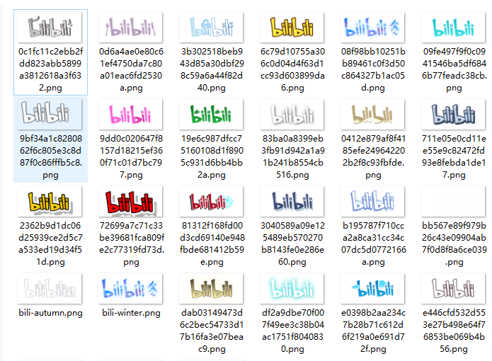
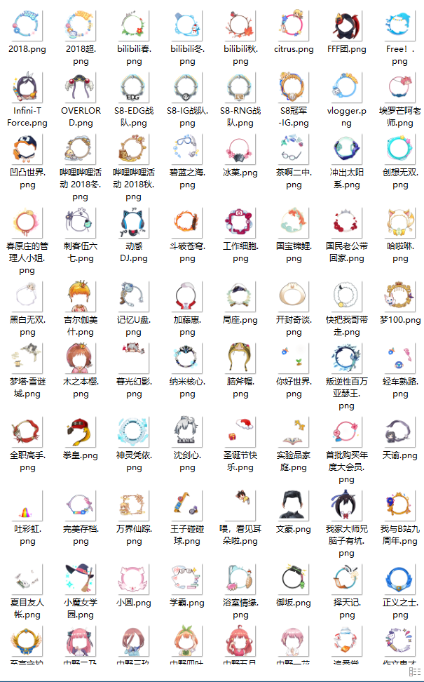
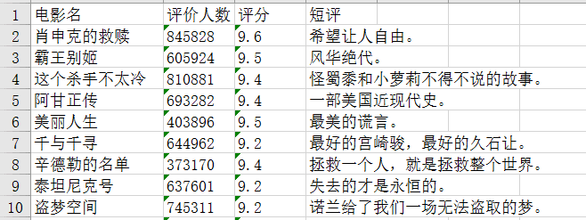
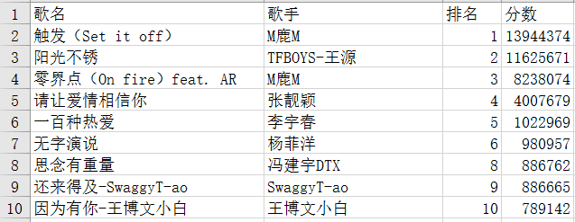
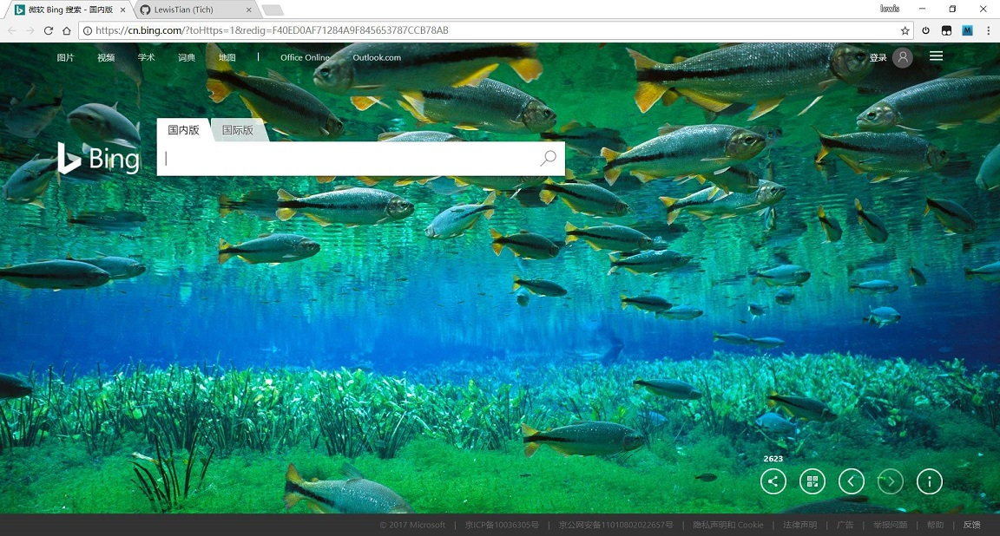
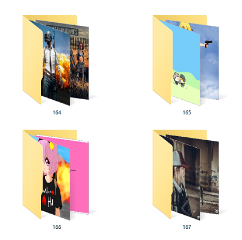

# Python3 爬虫合集
> 人生苦短, 我用Python!

## Table of Contents
| Ⅰ | Ⅱ | Ⅲ | Ⅳ | Ⅴ | Ⅵ | Ⅶ|Ⅷ |Ⅸ |X |
| :--------: | :---------: | :---------: | :---------: | :---------: | :---------:|:---------:|:---------:|:---------:|:---------:|
| [嗶哩嗶哩](#bilibili) | [豆瓣](#豆瓣)|[优酷](#优酷) | [Pixiv](#pixiv) |[网易云](#网易云)| [微博](#微博)|[知乎](#知乎)|[百度](#百度)|[微软](#微软)|[其他](#其他)|

## Bilibili
### [爬取弹幕并保存到txt中](bilibili/danmu.py)
- [Usage]: `python danmu.py $url`
- [Example]: `python danmu.py https://www.bilibili.com/video/av9933492/`

### [logo图片爬取](bilibili/bili-logo.py)

	

### [挂件图片爬取](bilibili/bili-pendant.py)
- 使用方法：将要爬取的视频链接写入 'bili-pendant.txt'

	

### [爬取历年播放量前 20 的 mad 数据](bilibili/bili-mad.py)
- [生成词云](bilibili/bili-mad-wordcloud.py)
- [数据及词云的材料](bilibili/bili-mad.7z)

	

## 豆瓣
### [爬取豆瓣电影top250并存到Excel中](douban/MovieTop250.py)

	

### [爬取豆瓣相册](douban/album.py)
- 根据相册 id 爬取所有图片，并保存到对应 id 目录下

	

## 优酷
### [爬取优酷视频弹幕](youku/danmu.py)
- 使用前记得修改 `data` 和 `headers` 中的 `Referer` 数据，我填入的是[火影第一集](http://v.youku.com/v_show/id_XNTQwMTgxMTE2.html)的弹幕请求数据
- [视频介绍](https://www.bilibili.com/video/av13784309/)

### [爬取优酷首页轮换图](youku/screen_pics.py)

	

## Pixiv
### [爬取首页的轮换图片](pixiv/cover.py)

	

## 网易云
### [下载网易云歌曲](netease/download_music.py)
- 网易云获取歌曲 `API` 为 `http://music.163.com/song/media/outer/url?id={song_id}.mp3`
- 只需要传入对应歌曲的 `song_id` 即可

## 微博
### [爬取微博亚洲新歌榜top50并存到Excel中](weibo/NewSongTop50.py)

	

## 知乎
### [爬取知乎回答图片](zhihu/image.py)
- 使用前需要更新问题 `id`, 填入 `Cookie`, `include` 应该不需要更新

### [爬取知乎异步加载页面数据(第二页及之后)](zhihu/ajax_page.py)
- 返回未验证方式是因为没有给headers传递 `X-API-VERSION`, `X-UDID`, `authorization` 等参数
- 问题来自知乎一位朋友问我, 因此做的比较粗糙, 没有详细提取数据, 仅将答主提取出来
- 得到的一些答主 [数据](zhihu/ajax_page.txt)

## 百度
### [爬取贴吧图片并保存到对应pid文件夹下](baidu/getTiebaPics.py)
- [Usage]: `python danmu.py $pid`
- [Example]: `python getTiebaPics.py 2271504759`

### [爬取百度图片](baidu/getBaiduPics.py)
- [Usage]: `python3 getBaiduPics.py [Word] [pages = 1]`
- [Example]: `python3 getBaiduPics.py 猫 30`
- 注: 图片将保存在关键词的同名目录下。

## 微软
### [爬取bing主页背景图](bing/cover.py)

	

	

## 其他
### [爬取「ONE · 一个」的插图](one/image.py)
- [「ONE · 一个」](http://www.wufazhuce.com/)

### 爬取[煎蛋网](http://jandan.net/ooxx/)妹子图
- [问题](http://bbs.fishc.com/thread-98098-1-1.html) 来自 [鱼C互助区](http://bbs.fishc.com/bestanswer.php?mod=huzhu)
- [代码](fishC/jandan.py)
    - 此代码并没有加下载图片的函数。因为我之前试过爬微博图片，与其自己写下载函数，倒不如把链接保存下来，全部扔到迅雷来下载，那样速度快多了
- 有时间改成多线程

### [爬取堆糖图片](duitang/picture.py)
- 有时间将爬取专辑的函数加上

	

### [爬取慕课网课程](imooc/README.md)

	

### [好特游戏壁纸](haote/wallpaper.py)

	

