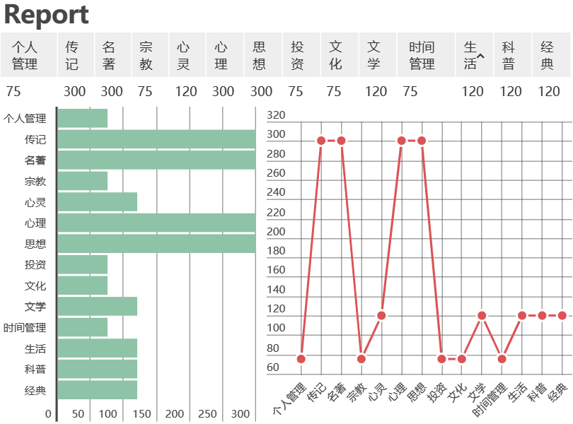
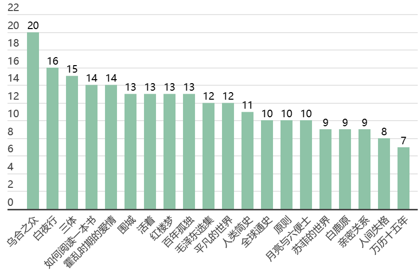

# reading: 豆瓣读书爬虫 && 读书记录


**Photo by Thought Catalog on Unsplash*

## 目录
- [前言](#前言)
- [安装](#安装)
- [分析](#分析)
	- [词云图](#词云图)
	- [高质量书目](#高质量书目)
	- [评分 top10 书目详情](#评分-top10-书目详情)
	- [历史类 top10 书目详情](#历史类-top10-书目详情)
	- [知乎 2019 书单推荐](#知乎-2019-书单推荐)
- [读书记录](READING.md)

## 前言

诚如苏子所言，于是呢就打算选高质量的书看看，且相信 [豆瓣读书](https://book.douban.com/) 中给出书的评分的真实性吧。

既然要筛选数据，那么第一步得有数据，那我又不想重新造轮子就直接上 Github 搜。

很容易找到一个 Python2.7 版的 [lanbing510/DouBanSpider](https://github.com/lanbing510/DouBanSpider)，稍作修改就得到了 Python3.7 版的了。主要是将 urllib 改成了 requests，然后加上了多线程，结果一跑就被 ban 了（滑稽


整个流程还是挺清晰的，用一个图说明一下。



<p></p>

加了代理还是不行，我哭了，就一个 tag_list 一个爬吧，加了个函数 prepare_spider 用来多线程加速 tag 的爬取。修改之后的流程如下。



<p></p>

与上面多线程不同的是，上面一个 thread 负责一个 tag_list，而这里一个 thread 负责一个 tag。

为了与原来代码逻辑保持一致，在 do_spider 中加了一段判断，如果传入的 book_tag_lists 为字符串就将其转为列表，因此前后两种方法调用 do_spider 都没问题了。

```python
def do_spider(book_tag_lists):
    book_lists = []

    if isinstance(book_tag_lists, str):
        book_tag_lists = [book_tag_lists]

    for book_tag in book_tag_lists:
        book_list = book_spider(book_tag)
        book_list = sorted(book_list, key=lambda x: x[1], reverse=True)
        book_lists.append(book_list)

    save_as_csv(book_lists, book_tag_lists)
```

至于为什么要保存为 csv，因为我觉得它比保存为 excel 更“轻”，虽然二者均可以使用 Excel 打开，但是 csv 的大小比 excel 小多了。

最后得到的数据都保存到 csv 目录了。

## 安装

我使用的是 Python3.7 的版本，建议安装和我一样的版本，避免出现一些玄学的问题。

```bash
>> git clone https://github.com/LewisTian/douban-books.git
>> cd douban-books
>> pip install -r requirements.txt
>> python src/books.py
```

## 分析

让我们康康爬取的数据吧（保存的 csv 不能直接用 Excel 打开，会是乱码，需要用记事本将其转码为 ANSI 然后打开）

最后一列是书的 id，可以通过 `https://book.douban.com/subject/{book_id}/?from=tag_all` 访问。

~~由于只得到了一点数据，具体分析还是到所有数据都爬到了再说吧🙄~~

就这样吧，一共拿到 14 个类别的书目。

<u>***文学.csv***</u>


### 词云图

仅生成了部分类型的词云图，生成步骤为：

1. 使用 [src/utils.py](src/utils.py) 脚本中的 convert 函数提取出作者和书名信息（这里就体现了 csv “轻”的好处）
2. 使用 [WordCloud Generator](https://github.com/LewisTian/PyQt5-Apps#wordcloud-generator) 生成词云图

背景图为 [images/basketball.jpg](images/basketball.jpg)，若是需要生成图中包含更多信息可以手动调大图片尺寸（实际操作中我将其调成为 1000*1000）

|   经典     |   文学    |  个人管理 | 科普 |
|  --------  | -------   |-------   |---- |
|     |  | | |

### 高质量书目

有四个类别的 9 分以上数量达到 300；大概是因为分类的不同，有些书同时存在若干类别导致的。



### 评分 top10 书目详情

在用 utils.py 提取前 10 的时候很有趣，最后俩是一样的，都是《卡拉马佐夫兄弟》，于是就加了一个。

或许可以从这 10 本书看起，慢慢来咯🤪

|序号|书名|评分|作者
|--|---|--|--
|1|[Stalin](https://book.douban.com/subject/25883928/?from=tag_all)|9.9|Stephen Kotkin 
|2|[野鸟形态图鉴](https://book.douban.com/subject/33377950/?from=tag_all)|9.9|[日]赤勘兵卫 / 赵天 
|3|[DK大历史](https://book.douban.com/subject/30420866/?from=tag_all)|9.9|[美] 大卫·克里斯蒂安 / DK / 徐彬 / 谭滢 / 王小琛 
|4|[梅特涅：帝国与世界](https://book.douban.com/subject/33376541/?from=tag_all)|9.8|[德] 沃尔弗拉姆•希曼（Wolfram Siemann） / 杨惠群 
|5|[普里莫·莱维传](https://book.douban.com/subject/27667782/?from=tag_all)|9.8|[英]伊恩·汤姆森 / 杨晨光 
|6|[人生的智慧](https://book.douban.com/subject/27081974/?from=tag_all)|9.8|[德]亚瑟·叔本华 / 张红玉 / 卢凯 
|7|[复分析](https://book.douban.com/subject/3788399/?from=tag_all)|9.8|(美) 尼达姆 (Needham, T.) / 齐民友
|8|[人类起源的故事](https://book.douban.com/subject/33408124/?from=tag_all)|9.8|[美]大卫·赖克 / 叶凯雄 / 胡正飞 
|9|[卡拉马佐夫兄弟](https://book.douban.com/subject/25887924/?from=tag_all)|9.7|陀思妥耶夫斯基 (Ф.М.Достоевский) / 荣如德
|10|[辩论：美国制宪会议记录](https://book.douban.com/subject/25817153/?from=tag_all)|9.7|(美)麦迪逊(MadisonJ. ) / 尹宣 

### 历史类 top10 书目详情

因为我比较喜欢历史类的书，因此又特地将历史类书爬了下来，下面是前十书目详情。

|序号|书名|评分|作者
|--|---|--|--
1|[DK大历史](https://book.douban.com/subject/30420866/?from=tag_all)|9.9|[美] 大卫·克里斯蒂安 / DK / 徐彬 / 谭滢 / 王小琛 
2|[至高权力](https://book.douban.com/subject/30394978/?from=tag_all)|9.8|(美) 杰夫·谢索 / 陈平 
3|[国家与文明的起源](https://book.douban.com/subject/33395265/?from=tag_all)|9.8|[美] 埃尔曼•塞维斯 / 龚辛 / 郭璐莎 / 陈力子 
4|[梅特涅：帝国与世界](https://book.douban.com/subject/33376541/?from=tag_all)|9.8|[德] 沃尔弗拉姆•希曼（Wolfram Siemann） / 杨惠群 
5|[普里莫·莱维传](https://book.douban.com/subject/27667782/?from=tag_all)|9.8|[英]伊恩·汤姆森 / 杨晨光 
6|[拜占庭帝国史](https://book.douban.com/subject/30322990/?from=tag_all)|9.8|[美] A.A.瓦西列夫 / 徐家玲 
7|[唐代长安与西域文明](https://book.douban.com/subject/3327997/?from=tag_all)|9.7|向达 
8|[艺术的故事](https://book.douban.com/subject/26423502/?from=tag_all)|9.7|[英]E.H.贡布里希 / 范景中 / 杨成凯 
9|[艺术的故事](https://book.douban.com/subject/3162991/?from=tag_all)|9.6|[英] 贡布里希 (Sir E.H.Gombrich) / 范景中 / 杨成凯 
10|[五四运动史](https://book.douban.com/subject/33391323/?from=tag_all)|9.6|[美]周策纵 / 陈永明 / 张静 

### 知乎 2019 书单推荐

将问题 [2019年你的书单有什么书？](https://www.zhihu.com/question/306249128) 下 47 页 939 个回答全部都爬下来了，数据在 csv/zhihu.7z。

- 推荐书的数量

一共有 1733 本书（你乎是真的🐮🍺），你们看得完算我输。


<p></p>

- 推荐榜前 20 的书目

下面是各位 dalao 推荐次数出现最多的 20 本书，2019 应该可以看完吧？



<p></p>

- 词云图

将所有书名生成了词云图，中间两个大字有点感动，而与稍下两个字对比就比较有意思了。


## LICENSE

Copyright (c) 2019 Lewis Tian. Licensed under the MIT license.