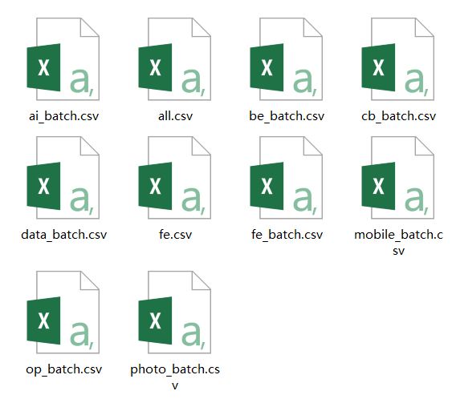
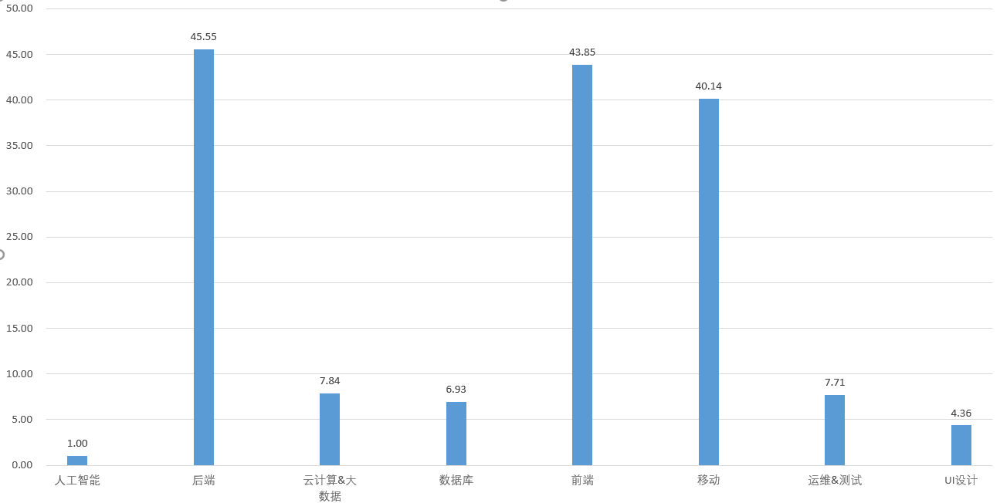
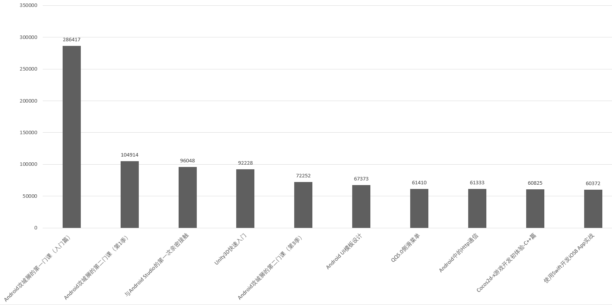
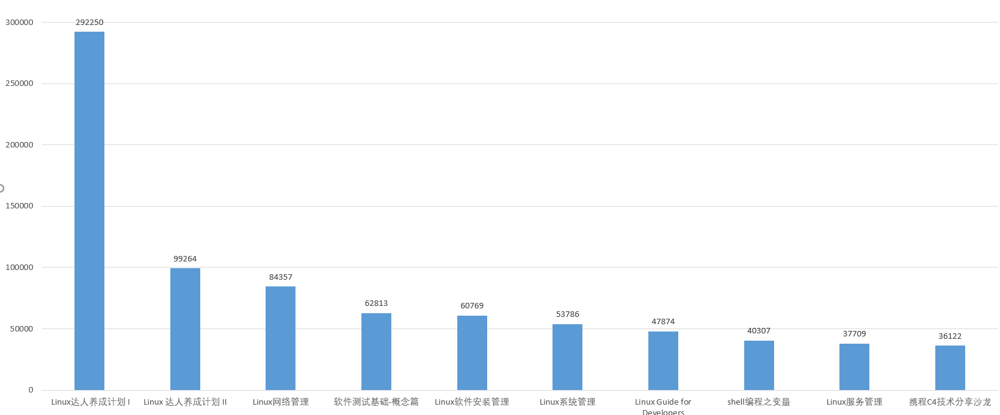
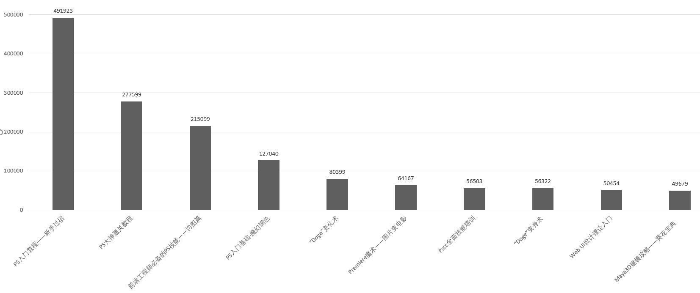
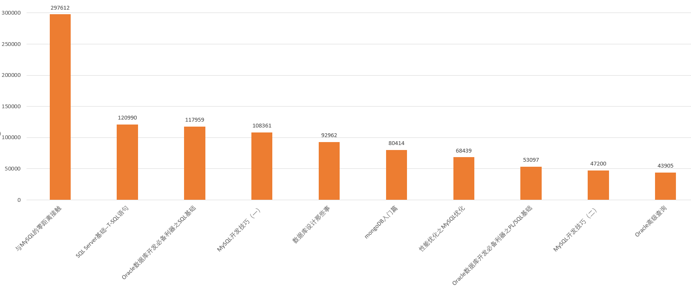
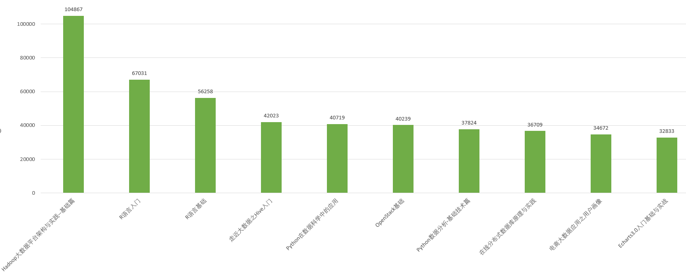
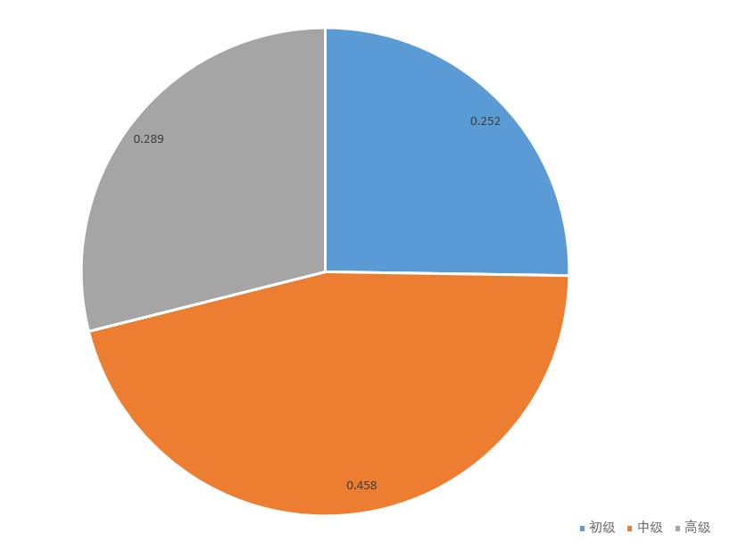
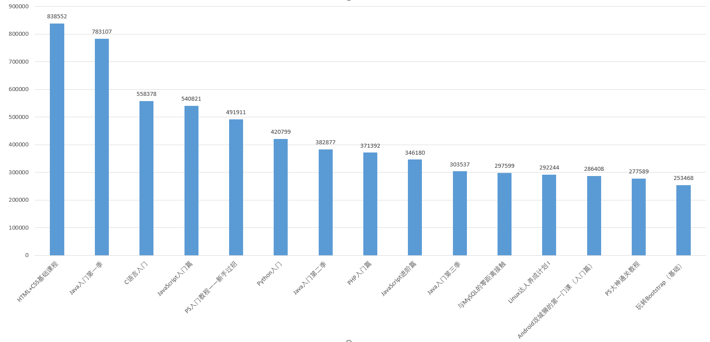

## 慕课网课程爬虫

### 声明
> 本项目所有数据来自 **慕课网**, 获取与共享之行为或有侵犯 **慕课网** 权益的嫌疑, 若被告知需停止共享与使用, 本人会及时删除整个项目. 请您了解相关情况, 并遵守 **慕课网** 协议。

### 项目说明
爬取数据的方式分为三种:
- 直接全部爬取, 将数据存为 `CSV`
- 按照慕课网的分类, 按类别爬取全部数据, 并分别存为 `CSV`
- 根据输入的类别缩写关键词爬取数据, 然后存为名字为关键词的 `CSV`

慕课网的课程分类以及对应关键词如下:
```
前端: fe
后端: be
移动: mobile
数据库: data
人工智能: ai
云计算&大数据: cb
运维&测试: op
UI设计: photo
```

分别按三种方式跑完得到的数据如下:
<div align="center">
	
</div>

### 数据分析
- 按方式二爬取后各类别 `CSV` 文件大小分布图

可以清楚看到 `前端` `后端` `移动` 这三个类别课程是最多的, 侧面反映出这三个是最火的
<div align="center">
	
</div>

- 后端开发学习人数 `TOP10` 课程图

其中有四门是 `Java` 两门是 `Python` 占到了 `4/5` 
<div align="center">
	
</div>

- 前端开发学习人数 `TOP10` 课程图
<div align="center">
	
</div>

- 移动开发学习人数 `TOP10` 课程图
<div align="center">
	
</div>

- 运维&测试学习人数 `TOP10` 课程图

个人表示下面两个 `Linux` 入门课程很不错, `Tony` 老师讲得很好
<div align="center">
	
</div>

- `UI` 设计学习人数 `TOP10` 课程图
<div align="center">
	
</div>

- 数据库设计学习人数 `TOP10` 课程图
<div align="center">
	
</div>

- 云计算&大数据学习人数 `TOP10` 课程图
<div align="center">
	
</div>

- 课程等级分布图
<div align="center">
	
</div>

- 学习人数 `TOP15` 课程图
<div align="center">
	
</div>

- 课程 `label` 的词云图
<div align="center">
	
</div>

### 使用说明
```
>> git clone https://github.com/LewisTian/imooc-course.git
>> cd imooc-course
>> pip install bs4
>> pip install html5lib
# 第一种方式 两种
>> python course.py 
>> python course.py -t 1
# 第二种方式
>> python course.py -t 2
# 第三种方式
>> python course.py -t 3 -c fe
```

#### 注：如想用 `Excel` 打开这个保存的 `CSV` 文件, 则需要先用记事本打开将编码改为 `ANSI` , 否则直接打开的话中文是乱码
